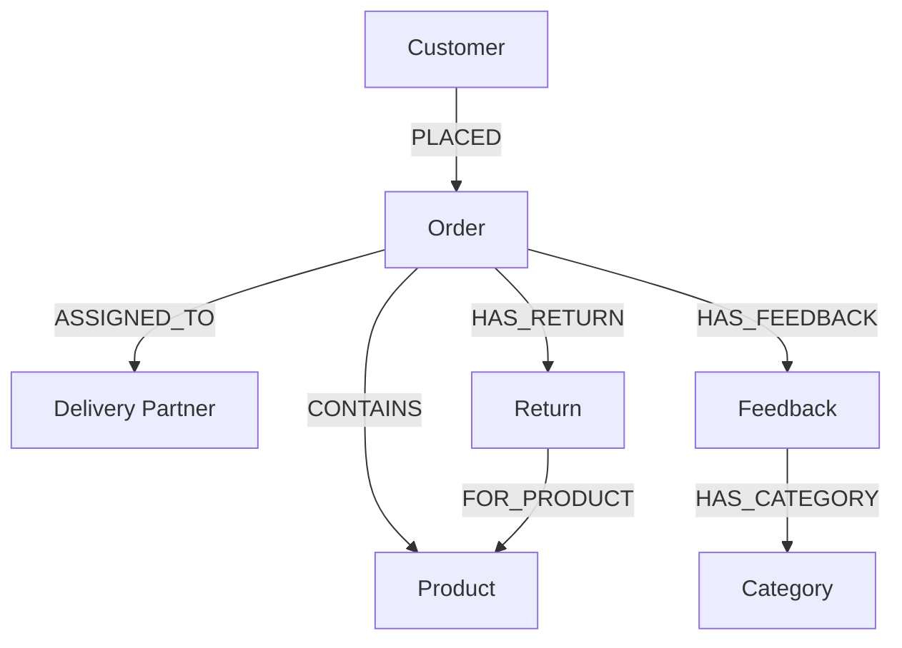
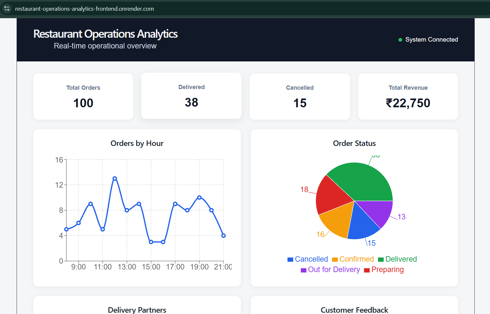
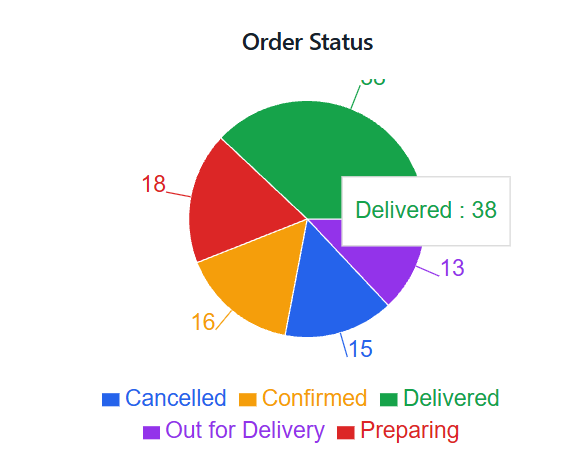
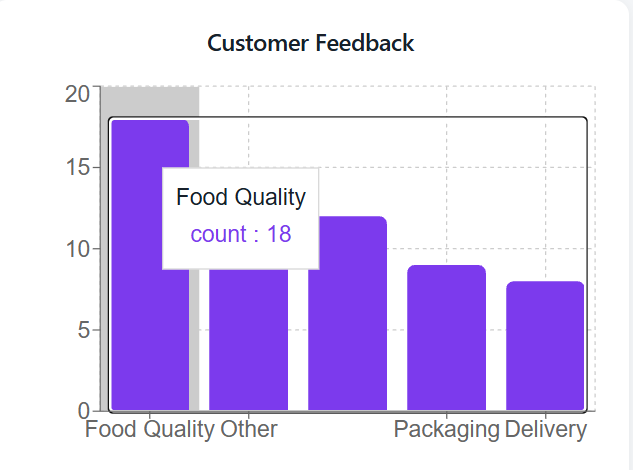

# Restaurant Operations Analytics

A full-stack restaurant operations analytics application backed by **CognoDB**, a managed graph database.

The application helps restaurant operations teams monitor orders, delivery partners, customer feedback, products, and returns through a graph-based data model and interactive dashboard.

## Live Application

**Frontend:**  
https://restaurant-operations-analytics-frontend.onrender.com

**Backend API:**  
https://restaurant-operations-analytics.onrender.com

**GitHub Repository:**  
https://github.com/vijaydeva210/restaurant-operations-analytics

---

## Problem Statement

Restaurant operations involve multiple connected entities:

- Customers place orders.
- Orders contain products.
- Orders are assigned to delivery partners.
- Orders can receive customer feedback.
- Feedback can belong to operational categories.
- Orders can generate returns or replacement requests.

Looking at these entities independently makes relationship-based operational questions harder to answer.

This application provides a centralized dashboard for monitoring:

- Total orders
- Delivered and cancelled orders
- Revenue
- Orders by hour
- Order status distribution
- Active and inactive delivery partners
- Customer feedback categories
- Returns and replacements

---

## Why a Graph Database?

The application uses **CognoDB** as the graph data layer.

The important questions in this use case involve relationships between entities rather than only isolated records.

For example:

```text
Customer
   |
   | PLACED
   v
Order
   |
   | CONTAINS
   v
Product
```

This allows the application to answer questions such as:

> Which products are ordered most frequently, and how many unique customers ordered them?

Another relationship traversal is:

```text
Customer
   |
   | PLACED
   v
Order
   |
   | HAS_FEEDBACK
   v
Feedback
   |
   | HAS_CATEGORY
   v
Category
```

This makes it straightforward to explore relationships across several connected entities.

A relational database could represent the same information, but these relationship-oriented queries would require multiple joins. The graph model represents the relationships directly and makes multi-hop traversal natural.

---

## Graph Data Model



### Nodes

| Node | Main Purpose |
|---|---|
| `Customer` | Represents a restaurant customer |
| `Order` | Represents a customer order |
| `Product` | Represents a product ordered by a customer |
| `DeliveryPartner` | Represents a delivery partner |
| `Feedback` | Stores customer feedback text |
| `Category` | Represents feedback categories |
| `Return` | Represents a return or replacement request |

### Relationships

| Relationship | Meaning |
|---|---|
| `PLACED` | Customer placed an order |
| `CONTAINS` | Order contains a product |
| `ASSIGNED_TO` | Order is assigned to a delivery partner |
| `HAS_FEEDBACK` | Order has customer feedback |
| `HAS_CATEGORY` | Feedback belongs to a category |
| `HAS_RETURN` | Order has a return/replacement request |
| `FOR_PRODUCT` | Return/replacement relates to a product |

---

## Technology Stack

### Frontend

- React
- Vite
- JavaScript
- Recharts
- CSS

### Backend

- Python
- Django
- Django REST Framework
- Neo4j Python Driver

### Database

- CognoDB Cloud
- openCypher over Bolt

### Deployment

- Render Web Service — Django backend
- Render Static Site — React frontend
- CognoDB Cloud — graph database

---

## Architecture

```text
                         User Browser
                              |
                              v
                +--------------------------+
                |     React + Vite         |
                |     Dashboard UI         |
                +------------+-------------+
                             |
                          HTTP/JSON
                             |
                             v
                +--------------------------+
                |      Django REST API     |
                |       Django + DRF       |
                +------------+-------------+
                             |
                    Neo4j Python Driver
                             |
                             v
                +--------------------------+
                |       CognoDB Cloud      |
                |      Graph Database      |
                +--------------------------+
```

---

## Dashboard Features

### Operational Summary

The dashboard displays:

- Total orders
- Delivered orders
- Cancelled orders
- Total revenue

### Orders by Hour

Orders are grouped by the hour extracted from the stored `order_time` timestamp.

### Order Status

Displays the distribution of:

- Confirmed
- Preparing
- Out for Delivery
- Delivered
- Cancelled

### Delivery Partners

Displays the number of:

- Active delivery partners
- Inactive delivery partners

### Customer Feedback

The raw feedback is stored as text.

For dashboard analysis, feedback text is classified into operational categories using keyword-based rules:

- Delivery
- Food Quality
- Packaging
- Order Issue
- Other

### Returns & Replacements

Displays the number of return and replacement requests.

---

## Graph Queries

### 1. Orders by Hour

The application extracts the hour from the stored order timestamp:

```cypher
MATCH (o:Order)
WITH datetime(o.order_time).hour AS hour, count(o) AS orders
RETURN hour, orders
ORDER BY hour
```

This powers the Orders by Hour chart.

---

### 2. Feedback Categorization

Feedback text is classified into operational categories:

```cypher
MATCH (f:Feedback)
WITH toLower(f.text) AS text

RETURN
    CASE
        WHEN text CONTAINS 'delivery'
          OR text CONTAINS 'delayed'
          OR text CONTAINS 'late'
          OR text CONTAINS 'driver'
          OR text CONTAINS 'partner'
        THEN 'Delivery'

        WHEN text CONTAINS 'food'
          OR text CONTAINS 'taste'
          OR text CONTAINS 'quality'
          OR text CONTAINS 'cold'
        THEN 'Food Quality'

        WHEN text CONTAINS 'package'
          OR text CONTAINS 'packaging'
          OR text CONTAINS 'damaged'
          OR text CONTAINS 'spill'
        THEN 'Packaging'

        WHEN text CONTAINS 'wrong'
          OR text CONTAINS 'missing'
          OR text CONTAINS 'incorrect'
        THEN 'Order Issue'

        ELSE 'Other'
    END AS category,

    count(*) AS count

ORDER BY count DESC
```

---

### 3. Multi-Hop Product / Customer Analysis

This query traverses:

```text
Customer → Order → Product
```

```cypher
MATCH (c:Customer)-[:PLACED]->(o:Order)-[:CONTAINS]->(p:Product)

RETURN
    p.name AS product,
    count(o) AS total_orders,
    count(DISTINCT c) AS unique_customers

ORDER BY total_orders DESC
```

It answers:

> Which products are ordered most frequently, and how many unique customers ordered them?

---

### 4. Multi-Hop Customer Feedback Analysis

This query traverses:

```text
Customer → Order → Feedback → Category
```

```cypher
MATCH (c:Customer)-[:PLACED]->(o:Order)
      -[:HAS_FEEDBACK]->(f:Feedback)
      -[:HAS_CATEGORY]->(cat:Category)

RETURN
    c.customer_id AS customer_id,
    cat.name AS feedback_category,
    count(f) AS feedback_count

ORDER BY feedback_count DESC
```

This connects customers with the operational categories associated with feedback on their orders.

These multi-hop queries demonstrate why a graph representation is useful for this use case.

---

## Parameterized Cypher

The application uses the official Neo4j Python Driver and parameterized Cypher values.

For example:

```python
run_query(
    """
    MERGE (c:Customer {customer_id: $customer_id})
    SET c.name = $name,
        c.location = $location
    """,
    {
        "customer_id": customer_id,
        "name": name,
        "location": location
    }
)
```

Values are passed separately from the Cypher statement rather than being concatenated into query strings.

---

## Seed Data

The repository includes:

```text
backend/seed_data.py
```

The script creates realistic sample data for:

- 10 Customers
- 10 Products
- 5 Feedback Categories
- 8 Delivery Partners
- 100 Orders
- Feedback records
- Return/replacement records

It also creates the graph relationships used by the application.

The seed script uses deterministic random generation with:

```python
random.seed(42)
```

so repeated development runs generate the same dataset.

### Important

The seed script clears the existing graph before recreating the sample dataset:

```cypher
MATCH (n) DETACH DELETE n
```

This is intended for the dedicated development/assessment database and should not be used against production data.

---

## Project Structure

```text
restaurant-operations-analytics/
│
├── backend/
│   ├── analytics/
│   │   ├── database.py
│   │   ├── exception_handler.py
│   │   ├── urls.py
│   │   └── views.py
│   │
│   ├── config/
│   │   ├── settings.py
│   │   ├── urls.py
│   │   ├── wsgi.py
│   │   └── ...
│   │
│   ├── manage.py
│   ├── seed_data.py
│   └── test_connection.py
│
├── frontend/
│   ├── src/
│   │   ├── App.jsx
│   │   ├── App.css
│   │   └── ...
│   ├── package.json
│   └── ...
│
├── docs/
│   ├── screenshots/
│   └── screen-recordings/
│
├── .gitignore
├── README.md
└── requirements.txt
```

---

## Environment Variables

### Backend

The backend reads sensitive configuration from environment variables.

Example local `.env`:

```env
COGNODB_URI=<your-cognodb-bolt-uri>
COGNODB_USERNAME=cognodb
COGNODB_PASSWORD=<your-cognodb-password>

SECRET_KEY=<your-django-secret-key>
DJANGO_DEBUG=True
DJANGO_ALLOWED_HOSTS=127.0.0.1,localhost
```

Production values are configured through the hosting platform.

### Security

Do not commit:

```text
.env
```

or any database credentials to GitHub.

The repository `.gitignore` excludes environment files and local development artifacts.

---

## Local Setup

### 1. Clone the repository

```bash
git clone https://github.com/vijaydeva210/restaurant-operations-analytics.git
cd restaurant-operations-analytics
```

### 2. Create a Python virtual environment

Windows:

```powershell
python -m venv .venv
.venv\Scripts\activate
```

### 3. Install dependencies

```powershell
pip install -r requirements.txt
```

### 4. Create a CognoDB instance

1. Create a CognoDB Cloud account.
2. Create a free instance.
3. Save the generated Bolt URI and password.
4. Add the values to the local `.env` file.

CognoDB uses the Bolt protocol and the official Neo4j drivers.

### 5. Verify the database connection

```powershell
cd backend
python test_connection.py
```

Expected:

```text
Connected to CognoDB successfully!
```

### 6. Load the sample graph

```powershell
python seed_data.py
```

### 7. Apply Django migrations

```powershell
python manage.py migrate
```

### 8. Run the backend

```powershell
python manage.py runserver
```

Backend:

```text
http://127.0.0.1:8000
```

Example:

```text
http://127.0.0.1:8000/api/summary/
```

### 9. Run the frontend

Open another terminal:

```powershell
cd frontend
npm install
npm run dev
```

Frontend:

```text
http://localhost:5173
```

---

## API Endpoints

| Endpoint | Purpose |
|---|---|
| `/api/summary/` | Dashboard summary |
| `/api/orders-by-hour/` | Orders grouped by hour |
| `/api/delivery-partners/` | Delivery partner status |
| `/api/feedback-categories/` | Feedback category counts |
| `/api/order-status/` | Order status distribution |
| `/api/returns/` | Returns and replacements |
| `/api/product-customer-analysis/` | Customer → Order → Product traversal |
| `/api/customer-feedback-analysis/` | Customer → Order → Feedback → Category traversal |

---

## Error Handling

### Backend

The application handles database failures through a custom Django REST Framework exception handler.

Database connectivity failures are converted into a controlled service response instead of exposing raw database exceptions to the client.

### Frontend

The React application provides:

- Loading state
- Error state
- Retry action

This prevents the dashboard from silently displaying an incomplete state when the API is unavailable.

---

## Deployment

### Backend

The Django API is deployed as a Render Web Service:

```text
https://restaurant-operations-analytics.onrender.com
```

### Frontend

The React application is deployed as a Render Static Site:

```text
https://restaurant-operations-analytics-frontend.onrender.com
```

### Production Flow

```text
Browser
   |
   v
React Static Site
   |
   v
Django REST API
   |
   v
CognoDB Cloud
```

---

## Screenshots

### Dashboard Overview



### Analytics Dashboard



### Graph Query Results




---

## Screen Recording

Project walkthrough:

[Watch the project screen recording](docs/screenrecordings/project-demo.mp4)

---

## Future Improvements

Possible future improvements include:

- Date-range filtering
- Order-level drill-down
- More detailed product analytics
- Authentication and role-based access
- Advanced feedback classification
- Additional operational metrics

These improvements are outside the current assessment scope.

---

## Assessment Context

This project was developed as part of the Wexa AI CognoDB take-home assessment.

The application demonstrates:

- Graph data modeling
- CognoDB integration
- Cypher querying
- Multi-hop graph traversal
- Parameterized database access
- REST API development
- React-based analytics visualization
- Deployment
- Error handling
